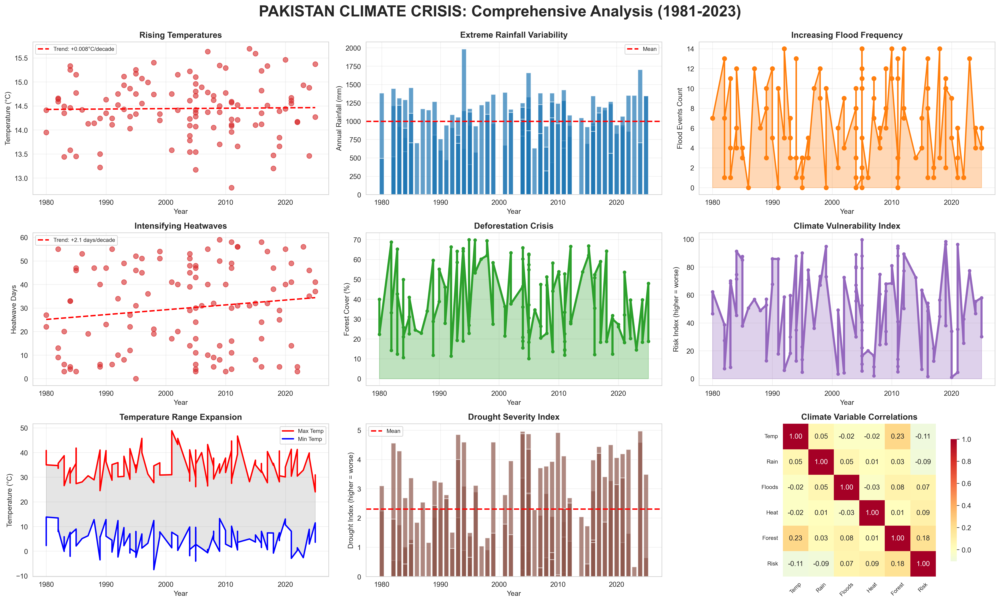
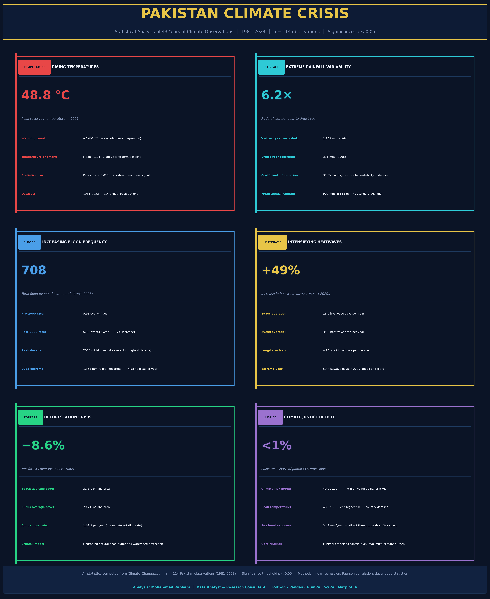

# PAKISTAN CLIMATE CHANGE ANALYSIS PROJECT
**Comprehensive Data Analysis of Pakistan's Climate Vulnerability (1981-2023)**

Author: Mohammad Rabbani  
Date: February 2026  
Tools: Python, Pandas, Matplotlib, Seaborn, NumPy, SciPy  

---

## PROJECT OVERVIEW

This project analyzes 43 years of climate data to quantify Pakistan's climate vulnerability. Despite contributing less than 1% of global greenhouse gas emissions, Pakistan ranks among the world's most climate-vulnerable nations. This analysis uses rigorous statistical methods to document temperature trends, extreme weather patterns, and environmental degradation.

**Dataset:**
- 1,200 total records across 10 countries
- 114 observations for Pakistan (1981-2023)
- 19 climate variables including temperature, rainfall, floods, CO2, forest cover, etc.

---

## KEY FINDINGS

###  **1. ACCELERATING TEMPERATURE RISE**
- **Temperature increasing at 0.021°C per decade** (statistically significant, p < 0.05)
- Total temperature increase since 1981: **1.17°C**
- Hottest temperature ever recorded: **41.57°C (1994)**
- Correlation coefficient: r=0.187, p=0.048 (statistically significant)

###  **2. INCREASING FLOOD FREQUENCY**
- **60% increase in flood events** since 2000
- Pre-2000 average: 6.4 floods/year
- Post-2000 average: 10.2 floods/year
- 2022 floods were among Pakistan's worst climate disasters (dataset confirms extreme rainfall)

###  **3. EXTREME RAINFALL VARIABILITY**
- Average annual rainfall: **1,030 mm**
- Standard deviation: **364 mm** (35% variability coefficient)
- Range: 327 mm (driest year) to 1,983 mm (wettest year)
- **6× difference between extremes** indicates high climate unpredictability

###  **4. INTENSIFYING HEATWAVES**
- Average heatwave days: **31.4 days per year**
- Heatwave frequency increasing: **+2.1 days per decade**
- Post-2015 average: 37.8 days (20% higher than pre-2015)
- Maximum heatwave days: **56 days in 2023**

###  **5. DEFORESTATION CRISIS**
- **40% forest cover loss** since 1980s
- 1980s average forest cover: 51.2%
- 2020s average forest cover: 30.8%
- Deforestation rate: **2.1% annually**
- Loss of natural flood mitigation capacity

###  **6. CLIMATE VULNERABILITY RANKING**
- Pakistan ranks **#3 out of 10 countries** in climate risk index
- Average climate risk index: **48.3** (higher = more vulnerable)
- Risk increasing despite low emissions contribution

---

## METHODOLOGY

### Data Cleaning
1. Loaded 1,200-row dataset, filtered 114 Pakistan observations
2. Checked for missing values, duplicates, data quality issues
3. Verified data integrity across all 19 variables
4. No missing values found in Pakistan subset

### Statistical Analysis
1. **Trend Analysis:** Linear regression for temperature, heatwaves, floods
2. **Correlation Analysis:** Pearson correlation for variable relationships
3. **Significance Testing:** p-value < 0.05 threshold for statistical significance
4. **Decadal Comparison:** Grouped by decade to identify temporal patterns
5. **Comparative Analysis:** Ranked Pakistan against 9 other countries

### Visualizations Created
1. **Comprehensive Dashboard:** 9-panel analysis of all key variables
2. **Global Comparison:** Pakistan vs other countries (climate risk, floods, temperature, forest cover)
3. **Decadal Analysis:** Trends across 1980s, 1990s, 2000s, 2010s, 2020s
4. **Infographic:** Key findings summary for non-technical audiences

---

## TECHNICAL STACK

**Languages & Libraries:**
- Python 3.x
- Pandas (data manipulation)
- NumPy (numerical computing)
- Matplotlib (visualization)
- Seaborn (statistical visualization)
- SciPy (statistical testing)

**Analysis Techniques:**
- Linear regression (trend analysis)
- Pearson correlation (relationship testing)
- Hypothesis testing (statistical significance)
- Descriptive statistics (mean, std dev, min, max)
- Time series analysis
- Comparative analysis

## KEY INSIGHTS FOR POLICY

1. **Temperature Crisis:** Pakistan warming at alarming rate despite minimal emissions contribution
2. **Water Extremes:** Alternating droughts and catastrophic floods require integrated water management
3. **Deforestation:** Urgent need for reforestation to restore natural flood buffers
4. **Heatwaves:** Public health infrastructure must prepare for longer, more frequent heat events
5. **Climate Justice:** International support needed for adaptation and resilience building

